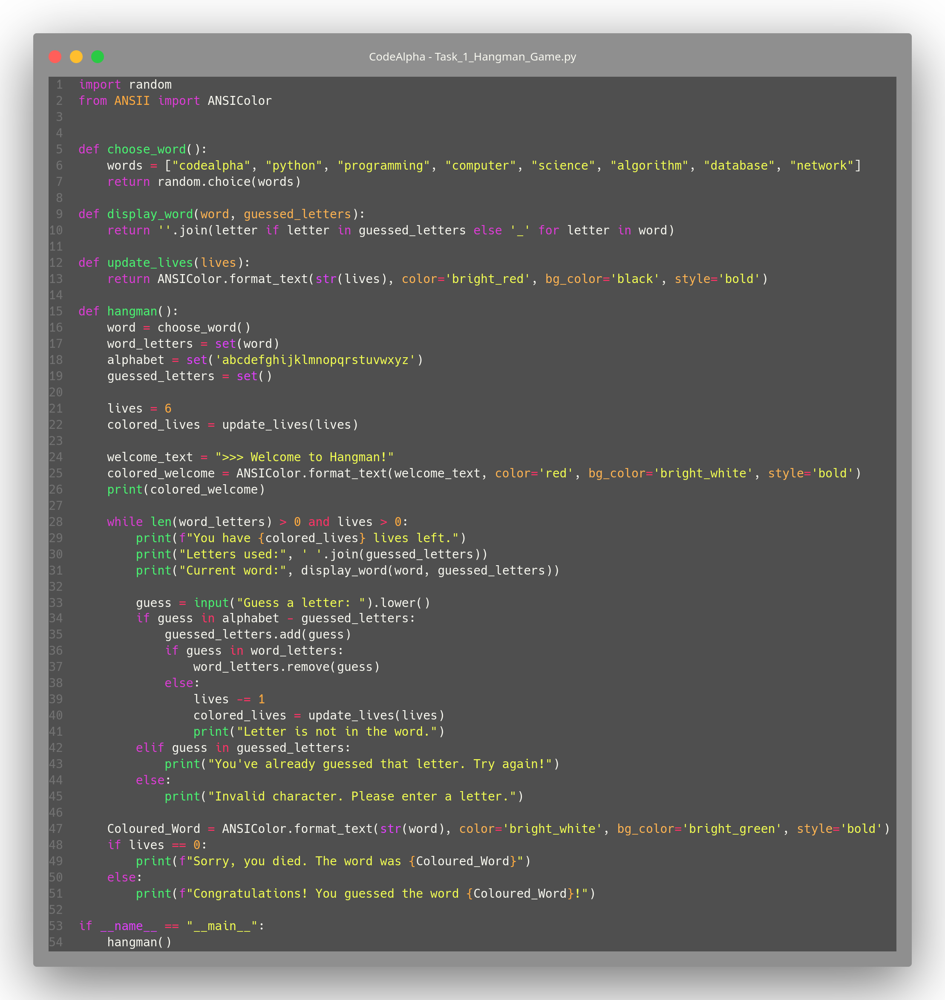
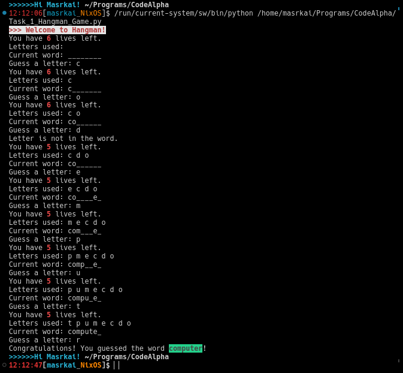

# this is made during CodeAlpha python virtual internship from July 1st to July 30th july of 2024
- it was completed and left locally since July 2nd

# Images

! [Code](Images/Code.png "Code")

! [Output](Images/Output.png "Run Example")

